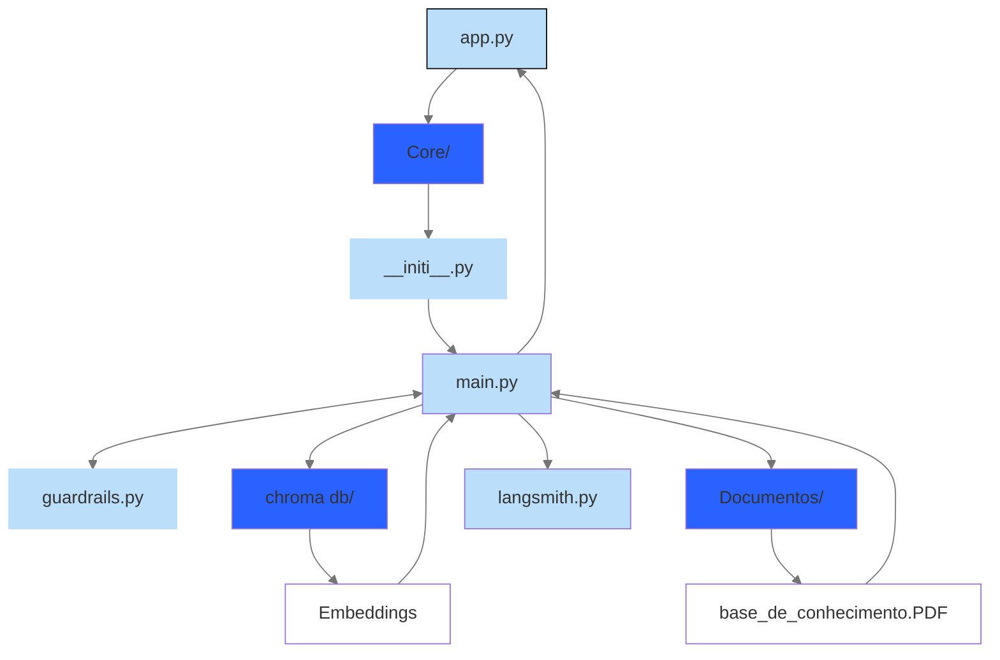

# Documentação do Agente

## Caso de Uso

Agente de IA que tira dúvidas sobre produtos e serviços de uma corretora de criptomoedas. 

### Problema

Manter uma equipe numerosa de atendimento representa um custo elevado para qualquer corretora de criptomoedas. Além de salários e encargos, há despesas com treinamento, supervisão, escalas de trabalho e a necessidade de expandir a equipe conforme a base de clientes cresce.

Um chatbot com IA reduz significativamente esses custos ao responder dúvidas frequentes de forma instantânea, consistente e disponível 24 horas por dia. Isso aumenta a eficiência de capital da empresa, permitindo que recursos financeiros sejam direcionados para áreas que geram mais valor, como segurança, desenvolvimento de produtos, compliance e inovação. Com isso, a corretora consegue atender mais clientes com menor custo operacional, mantendo qualidade e escalabilidade no atendimento.

### Solução

O chatbot de IA foi desenvolvido para oferecer respostas rápidas e confiáveis às principais dúvidas dos clientes sobre os produtos e serviços da corretora de criptomoedas. Em vez de depender exclusivamente de atendentes humanos para questões repetitivas, o sistema automatiza grande parte do atendimento, reduzindo o tempo de espera e melhorando a experiência do usuário.

Como solução, o chatbot aumenta a eficiência operacional, reduz custos com atendimento de primeiro nível, melhora a escalabilidade do suporte e proporciona respostas imediatas aos clientes. O resultado é um atendimento mais ágil, maior produtividade da equipe e uma utilização mais eficiente dos recursos da corretora.

Além disso, o Agente de IA também detecta as dúvidas mais frequentes dos clientes, os pontos de fricção e as necessidades não atendidas — dados valiosos para produto e suporte.

### Público-Alvo

Como fica na página principal do site, todos os tipos de clientes pode usar o Agente de IA para tirar dúvidas sobre produtos e serviços da exchange. Clientes premium tendem a usar menos, pois possuem atendimento personalizado. 

----------------------------------------------------------------------------------------------------------

## Persona e Tom de Voz

### Nome do Agente
Não possui nome. 

### Personalidade
A personalidade do agente é consultivo e direto. 

### Tom de Comunicação
Formal, técnico e seco. Está mais próximo de um robô do que humano. 

--------------------------------------------------------------------------------------------------------------

# Arquitetura

### Diagrama

## Componentes

| Componente              | Descrição                                                                 |
|:------------------------|:--------------------------------------------------------------------------|
| Interface               | Steamlite                                                      |
| LLM                     | gpt-4o-mini                                                               |
| Base de Conhecimento    | Arquivo PDF com informações sobre produtos e serviços da corretora, armazenados de forma local |
| Banco de Dados Vetorial | Chroma DB (open source)                                                   |
| Guardrails Open Ai      | Mecanismos que restringem e protegem o comportamento da IA.               |
| LangSmith               | Plataforma de LLMOps (Large Language Model Operations).                   |
| Data Lake (Storage)     | Repositório central para armazenamento de dados brutos.                   |

### Banco de Dados Vetorial

O projeto usou um  Banco de Dados Vetorial open source chamado Chroma DB. 

Um banco de dados vetorial armazena dados como representações matemáticas chamadas vetores.

Modelos de linguagem não entendem textos da mesma forma que os seres humanos. Antes de armazenar ou pesquisar um documento, eles transformam palavras, frases e parágrafos em representações matemáticas chamadas embeddings. Esses embeddings são vetores numéricos que capturam o significado semântico do conteúdo, fazendo com que textos com ideias semelhantes fiquem próximos uns dos outros em um espaço vetorial, mesmo quando utilizam palavras diferentes.

Quando um usuário faz uma pergunta, essa pergunta também é convertida em um embedding. Em seguida, o sistema procura quais documentos possuem vetores mais próximos, recuperando os trechos mais relevantes para fornecer contexto ao modelo de linguagem antes da geração da resposta.

É nesse momento que o banco de dados vetorial se torna indispensável. Em vez de enviar toda a documentação da corretora para o modelo de IA a cada consulta, o banco vetorial realiza uma busca por similaridade entre embeddings e retorna apenas os documentos realmente relacionados à pergunta do usuário. Dessa forma, o modelo recebe somente as informações necessárias para responder.

Essa arquitetura reduz significativamente a quantidade de tokens enviados ao modelo de linguagem, diminuindo o custo de inferência e melhorando o tempo de resposta. Sem um banco de dados vetorial, seria necessário enviar uma quantidade muito maior de documentos para que a IA encontrasse a resposta correta, aumentando o consumo de tokens, a latência e os custos operacionais. À medida que a base de conhecimento cresce, essa abordagem se torna cada vez menos eficiente e mais cara.

Por isso, bancos de dados vetoriais são um dos pilares da arquitetura de agentes de IA modernos. Eles permitem que o sistema localize rapidamente as informações mais relevantes, mantenha a qualidade das respostas e escale para grandes volumes de documentação sem elevar proporcionalmente os custos de processamento.

### Guardrails

Guardrails são mecanismos de segurança e governança que controlam o comportamento de um chatbot de IA, definindo limites sobre o que ele pode responder e como deve responder. Em vez de permitir que o modelo gere qualquer resposta, os guardrails aplicam regras para garantir que as informações fornecidas sejam consistentes com as políticas da empresa, requisitos regulatórios e boas práticas de segurança.

No mercado financeiro, sua importância é ainda maior. Instituições financeiras lidam diariamente com informações sensíveis, produtos regulados e decisões que podem impactar o patrimônio dos clientes. Um chatbot sem controles pode gerar respostas incorretas, divulgar informações confidenciais ou fornecer orientações inadequadas sobre investimentos e operações financeiras.

Ao implementar guardrails, é possível bloquear solicitações fora do escopo do atendimento, impedir o vazamento de dados, detectar conteúdo inadequado, validar respostas antes de enviá-las ao usuário e direcionar casos complexos para atendentes humanos. Dessa forma, a instituição reduz riscos operacionais, fortalece a conformidade regulatória e aumenta a confiabilidade das respostas geradas pela IA.

Em um chatbot para corretoras de criptomoedas, os guardrails são um componente essencial para garantir que a inteligência artificial atue de forma segura, previsível e alinhada às políticas internas e às exigências de compliance, oferecendo uma melhor experiência ao cliente sem comprometer a segurança da operação.

### Base de conhecimento

A base de consuta é um arquivo PDF com dados mockados da corretora Cripto BR. Ele funciona como a base de conhecimento para consultas de agentes de inteligência artificial voltados ao atendimento ao cliente, reunindo regras de negócio, tabelas de taxas e especificações de produtos.  

O Chroma DB é utilizado para indexar a base de conhecimento antes que o Agente de IA possa realizar consultas. Inicialmente, o conteúdo do arquivo PDF é extraído e dividido em pequenos trechos de texto (chunks). Em seguida, cada chunk é convertido em um embedding, ou seja, uma representação numérica que captura o significado semântico do texto por meio de um modelo de embeddings.

Após essa etapa, os embeddings são armazenados no banco vetorial do Chroma DB juntamente com seus metadados, como a referência ao documento de origem e a posição do trecho no PDF. Durante uma consulta, o Agente de IA não pesquisa diretamente no arquivo PDF. Em vez disso, ele compara o embedding da pergunta do usuário com os vetores armazenados no Chroma DB e recupera os trechos semanticamente mais relevantes para que o LLM possa gerar uma resposta fundamentada na base de conhecimento.

### LangSmith

O LangSmith é uma plataforma desenvolvida pela LangChain para observar, testar, avaliar e depurar aplicações baseadas em modelos de linguagem (LLMs). Seu principal objetivo é fornecer formas visuais para avaliar  o funcionamento interno de agentes de IA. O objetivo é registrar as etapas de execução para facilitar a identificação de erros, gargalos de desempenho e oportunidades de melhoria.

A ferramenta oferece recursos como tracing, testes de latência, avaliação automática de respostas (evaluation), comparação entre diferentes versões de prompts e monitoramento de aplicações em produção. Dessa forma, desenvolvedores conseguem testar e validar o comportamento de seus agentes de IA, além de otimizar a qualidade das respostas.

### Data Lake 

Um Data Lake é um repositório centralizado que armazena grandes volumes de dados em seu formato original, como arquivos, documentos, registros de sistemas, imagens e logs.

Seu principal objetivo é servir como base para auditoria do Banco Central do Brasil, análises, inteligência de negócios (BI), aprendizado de máquina e geração de insights. No contexto de um Agente de IA, por exemplo, um Data Lake pode armazenar históricos de conversas, métricas de desempenho, logs de execução e feedback dos usuários, permitindo identificar oportunidades de melhoria, monitorar o comportamento do sistema e apoiar decisões baseadas em dados.

-------------------------------------------------------------------------------------------------------------------------

## Segurança e Anti-Alucinação

### Estratégias Adotadas para Base de Consulta

- Agente só responde perguntas se o conteúdo estiver dentro da base de consulta (documentos/base_de_conhecimento_rag.pdf). Vale ressaltar que a estratégia para evotar alucinações para perguntas fora do contexto ainda não está adequada e precisa de melhorias. 

- Se a pergunta não estiver na base de consulta, o agente responde que a pergunta está fora de contexto. O código aplica restrição limitando a fonte de conhecimento da IA é ("system", "Responda exclusivamente com o conteúdo fornecido no contexto.")

- Os embeddings da base de consulta são armazenados localmente através do Chroma DB

### Estratégias Adotadas para Guardrails (Bloqueio de links externos)

- Bloqueio de links externos: Possui um bloco de código que detecta URLs com http, https e www. Entretanto, se colocar 'google.com', o Guardrails não detecta. Portanto, precisa de melhorias. 
  
- Bloqueio de links externos: bloco de código com lógica Booleana -> se detectar uso de link externo (TRUE), retorna com "Links não são permitidos nesta plataforma."

## Limitações do Agente de IA (teste de QA)

Para descobrir as limitações atuais do Agente de IA, foram feitos diversos testes de QA para testar o prompt. Segue abaixo as conclusões e melhorias sugeridas:

- O Gardrails da OpenAI ainda não está configurado para prevenir jailbreaks semânticos (apenas links externos). Nos testes de QA, deu conselhos para desabafar como se fosse um psicólogo.

- O método ("system", "Responda exclusivamente com o conteúdo fornecido no contexto.") para prevenir jailbreakings semânticos não é o melhor. Idealmente, isso deve estar melhor estruturado em guardrails.py e não em main.py. Talvez seja uma boa ideia trocar o Guardrails da OpenAI pelo Model Armor do Google (na minha experiência, funcionou muito melhor).

- Ainda não está suficientemente inteligente a ponto de entender que a frase "Qual a taxa do Bitcoin?" é a mesma coisa que "Qual a taxa para negociar Bitcoin?"
  
- Guardrails bloqueia corretamente links externos com http, https e www, mas não bloqueia links com .com, .io, .org, dentre outros.

- Data Lake: o Agente registra no Data Lake apenas o run_id de cada interação individual, em vez de armazenar um identificador que relacione todas as mensagens de uma mesma conversa. Recomenda-se implementar um mecanismo que permita agrupar as interações por sessão ou por cliente, possibilitando a análise do histórico completo das conversas. Além disso, é importante criar mecanismos de identificação do cliente (respeitando as políticas de privacidade aplicáveis) para compreender seus principais problemas, dúvidas e necessidades, gerando insights que apoiem a melhoria contínua da experiência do usuário.
